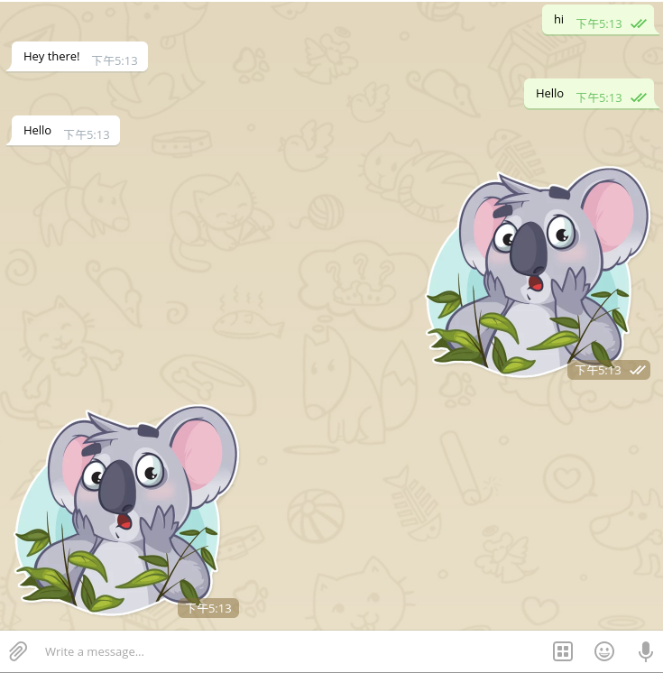

This sample-bot uses [Telegraf](https://github.com/telegraf/telegraf) framework

## Documentation

-[Telegram Bot API](https://core.telegram.org/bots/api)

-[Telegraf developer docs](http://telegraf.js.org)

## Telegram token

To use the [Telegram Bot API](https://core.telegram.org/bots/api), 
you first have to [get a bot account](https://core.telegram.org/bots) 
by [chatting with BotFather](https://core.telegram.org/bots#6-botfather).

BotFather will give you a *token*, something like `123456789:AbCdfGhIJKlmNoQQRsTUVwxyZ`.
With the token in hand, you can start developing your bot.


## Message

Message_type:text,video,location,photo...

```js

app.command(<Command>, (ctx) => {
  ctx.reply('Welcome!')
})

app.on(<Message_type>, (ctx) => {
  ctx.reply('Received!'))
})
```

## Example
  
```js
const Telegraf = require('telegraf')

const app = new Telegraf(<BOT_TOKEN>)

app.command('start', (ctx) => {
  console.log('start', ctx.from)
  ctx.reply('Welcome!')
})

app.hears('hi', (ctx) => ctx.reply('Hey there!'))

app.on('sticker', (ctx) => ctx.reply('👍'))

app.startPolling()
```

-Command


-Text



-In-line mode


